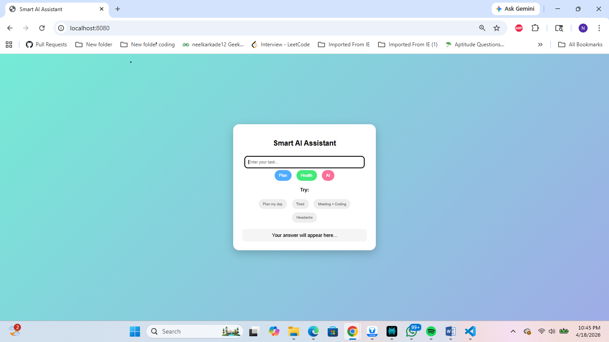
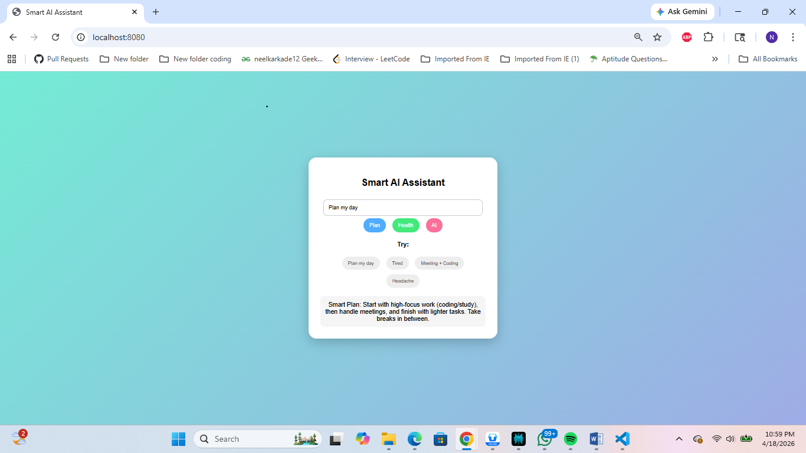

# Smart AI Assistant

## Overview
This project is a smart assistant that helps users plan tasks, manage health, and improve productivity.

## Features
- Task planning
- Health suggestions
- AI-like responses
- Interactive UI with predefined test inputs

## Tech Stack
- Java
- Spring Boot
- HTML, CSS, JavaScript

## How it works
User enters input → Frontend calls API → Backend processes logic → Response shown on UI

## Test Scenarios

### Planner API
- I have meeting and coding work
- I feel tired
- I have deadline today

### Health API
- headache
- stress
- tired

### AI Assistant
- Plan my day
- I want to study
- I have meeting
- I need productivity tips

## Screenshots

## Run
http://localhost:8080

## Note
This project uses AI-like decision logic based on rule-based conditions to provide context-aware responses.